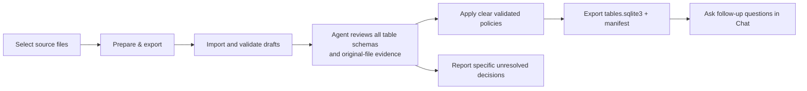
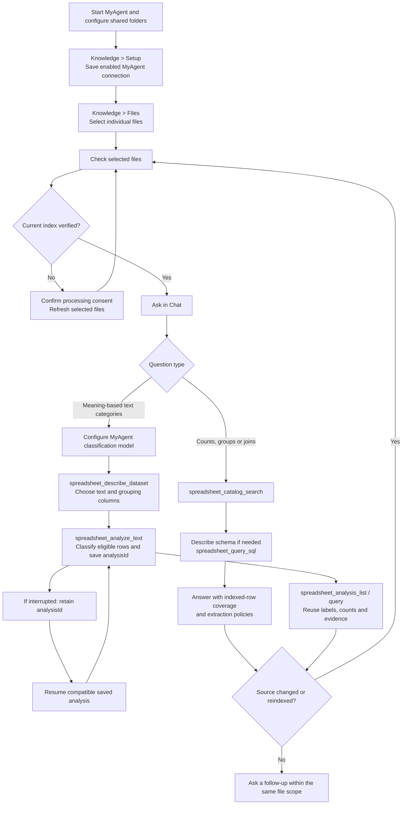

# Directory chat: data insights and analysis

The directory chat agent combines its existing file-inspection tools with SQLite queries and statistical methods. Select the individual source files, then ask a question. Simple overviews and lookups can use direct inspection; large-file aggregates and statistics run over complete prepared tables instead of loading every row into chat.

## 1. Prepare and export once

Click **Prepare & export** beside **New chat**. The button starts the existing chat agent with the clicked selection and authorizes preparation, agent review and SQLite export for that request. Separate preparation settings, another prompt and manual approval of clear tables are not required. A configured chat model is required because the agent performs the review.

The agent imports supported saved files locally, validates draft table policies, and describes every table and every column page. It checks row meaning, boundaries, types, decimal scales, units, keys and warnings, using the original file when more evidence is needed. It applies clear validated policies and preserves existing user-approved policies. Formula caches, hidden rows, possible subtotals and uncertain populations remain pending when a decision cannot be justified.

Finally, the agent exports Ready tables under Nawa's private **user-data/analytics/exports/Nawa table exports …/tables.sqlite3** directory, beside the app's embedding storage rather than among the source files. If it reaches Export before reviewing every table and column page, Export returns the next schema page to the agent and waits to publish until review is complete. A manifest records every selected source, applied policies, source versions and skipped/blocked tables. The chat reports the database path and coverage. Source files remain unchanged. Progress and Stop use the same chat controls as any other agent request. Existing workspace exports remain readable when their source versions still match.

Native preparation supports CSV, TSV, JSON, JSONL/NDJSON and Excel `.xlsx`/`.xlsm`. File and row limits are enforced; failed imports are not published as complete populations. Local source snapshots, table data, results and exports are stored without encryption. The button authorizes this batch and does not change saved settings. Stop cancels active work; incomplete exports are not published as completed batches.

**Knowledge → Tables** remains available for inspecting policies and resolving specific remaining decisions. Advanced preparation toggles and manual import/review are optional controls, not prerequisites for the button workflow.

## 2. Ask for insights, searches or calculations

Example prompts:

- “Give me insights from these sales files. Check distributions, regional differences and trends.”
- “Find records mentioning a delayed shipment, then compare their order values by region.”
- “Count distinct employees and report blank and duplicate IDs.”
- “Compare monthly revenue using a SQL window query.”
- “Calculate descriptive statistics and Pearson correlation for temperature and energy consumption.”

Chat reuses the exported SQLite snapshot for SQL queries when the requested current tables share that export, and verifies its fingerprint before and after querying. Otherwise it queries the current local prepared SQLite tables. `discover_datasets` and `describe_dataset` expose the selected table catalog, exact SQL identifiers, column names/types/scales, policies and original sources. `query_sql` runs parameterized read-only SELECT/WITH queries, including searches, subqueries, CTEs, joins, unions and window functions. Only the declared Ready datasets within the current individual-file selection are readable. Writes, private metadata, unselected tables, ATTACH, PRAGMA and extensions are denied.

`query_data` and `analyze_data` provide checked aggregates, exact integer/decimal calculations, descriptive statistics, Pearson correlation and period contributions. Original-file inspection remains useful for meanings, formulas and source records. SQL `__row` references the saved source row; source hashes and generations connect calculations to the original file.

### SQLite export and numeric accuracy

The standalone database contains the same applied typed table populations and SQL identifiers:

| Object | Contents |
| --- | --- |
| Data tables | Every included row, original source-row reference in `__row`, typed columns `c0`, `c1`, etc. |
| `nawa_tables` | Table names, source paths/hashes/generations, row counts, applied policies and approval origin |
| `nawa_columns` | Column IDs, display names, types, scales, units and roles |
| `nawa_manifest` | Complete export provenance and pending/unsupported/failed table information |

Integers and decimals retain exact signed 64-bit coefficients. Decimal value = stored coefficient / 10^scale; consult `nawa_columns` or the described SQL schema. Text, multiline values, nulls and source order are preserved. REAL and SQLite AVG use approximate floating point; SQLite SUM can overflow. Use the exact structured tools for decimal accounting and exact means instead of assuming arbitrary SQL preserves precision.

Result receipts retain executed SQL, parameters, source versions and available population coverage. Display caps do not sample aggregate inputs. Explicit SQL filters, limits and joins define the query population; inspect join multiplicity, missing values, duplicate IDs, mixed units and currencies before interpreting totals. Native previews and retrieval hits cannot establish whole-file statistics. Correlation and arithmetic period contributions do not establish causation.

When a source changes, prepare/refresh it again before reusing results. Unavailable files and unresolved tables must be named; a calculation over the Ready subset must not be presented as complete coverage of the selection. Selecting a folder never grants the chat access to all children.

## 3. Optional MyAgent analysis

See [MyAgent connection and indexing setup](MYAGENT_RAG.md) for full configuration instructions.

1. Start a compatible MyAgent.Server and ensure its configured shared folders include the source files.
2. In **Knowledge → Setup → Connection and search**, select MyAgent, configure the server URL and service API key, and enable/test/save the connection. **Settings → MyAgent → Connection** provides the same connection setup.
3. For text classification, also configure MyAgent's model/provider under the model settings. Nawa's chat model does not configure the server's classification model.
4. In **Knowledge → Files**, select the individual files and click **Check selected files**.
5. Confirm selected-file processing consent, then use **Refresh selected files** for missing or stale indexes. Check again for **Ready — snapshot verified**.
6. Keep the intended files selected and ask in Chat. Nawa native table approval is not required for ordinary MyAgent SQL.

### Spreadsheet SQL

Example: “Using MyAgent, count distinct nonempty employee IDs in the selected workbook and group them by department. Report blanks, duplicate IDs and any import truncation.”

MyAgent runs read-only SQL over server-indexed tables. It supports exploratory filters, groups and joins without Nawa's explicit review step. Results can include hidden rows and saved formula caches, and numeric columns may use floating point. Neither engine recalculates workbook formulas.

Check whether extraction limits truncated input rows or columns. A complete SQL aggregate covers the indexed table, which may be smaller than the original workbook. Output truncation limits displayed results; it is separate from input truncation.

### Text classification

Example: “Classify every eligible description in the selected support-ticket workbook as Billing, Login, Delivery or Other. Count categories by department and show uncertain rows with source quotes.”

The assistant describes the dataset, chooses the text column, starts `spreadsheet_analyze_text`, then queries the saved `analysisId`. Categories can be supplied by you or discovered from a sample. Classification processes eligible rows in batches and saves derived labels on MyAgent; it does not edit the workbook.

Ask for eligible, processed, blank, uncertain and failed-row counts. A completed analysis should account for all eligible rows with no failed rows. A category-discovery sample can miss rare categories, and model labels still require judgment. For multi-label analyses, category percentages can exceed 100% in total.

Use follow-up prompts such as “Show uncertain rows with verbatim evidence” or “Resume the saved analysis.” Interrupted progress can be resumed through its `analysisId`; resume is an explicit request, not automatic background continuation. New classification criteria or changed source revisions require a new compatible analysis.

## 4. Refresh, verify and troubleshoot

Before accepting an answer, check the engine used, selected-file coverage, row population, filters, units, formula warnings and source references. Count records with analytical tools; retrieved search hits or preview rows cannot establish a whole-file total.

| Situation | Action |
| --- | --- |
| Native table shows **Needs review** | Click **Prepare & export** to have the agent review and apply clear policies. Only unresolved population/formula decisions need targeted review. |
| Native table shows **Ready · Approved by agent** | Query it immediately. Inspect its recorded policy and limits; manual review is optional unless you require explicit human review. |
| `Invalid row grain` or a missing-grain message | Fill **What does one row represent? (required)** with the intended business record. |
| Approval asks for confirmation again | A policy edit cleared it. Select the confirmation checkbox after the final edit. |
| Approval stays disabled while idle | Restart Nawa with the current build. The current review UI disables approval only during validation. |
| `Cannot find module ... worker-*.js` | Restart Nawa from a complete current build so its main process and worker artifacts belong to the same build. Retry the operation. |
| MyAgent reports **Needs indexing** or **Needs refresh** | Use **Knowledge → Files → Refresh selected files**, then check readiness again. |
| SQL totals differ from native totals | Compare grain, boundaries, hidden rows, exclusions, formula-cache policy, import limits and numeric types. |
| Classification is interrupted | List saved analyses and resume the compatible `analysisId`; inspect failed and uncertain rows. |
| A source file changes | Refresh the engine you are using. Newly imported native generations must be validated under the saved approval mode; do not reuse stale receipts or classification results. |

Selecting a folder, importing it, or indexing it never authorizes Chat to read all its files. Select each intended file, and report missing coverage for questions spanning multiple files.

## Implementation references

- [Native import and table-review UI](../apps/shell/src/renderer/src/analytics/AnalyticsToolbar.tsx)
- [Native analysis tools and calculation rules](../apps/shell/src/renderer/src/analytics/skill.ts)
- [MyAgent tool routing and usage rules](../apps/shell/src/renderer/src/rag/myagent-skill.ts)
- [MyAgent connection, indexing and source freshness](MYAGENT_RAG.md)
